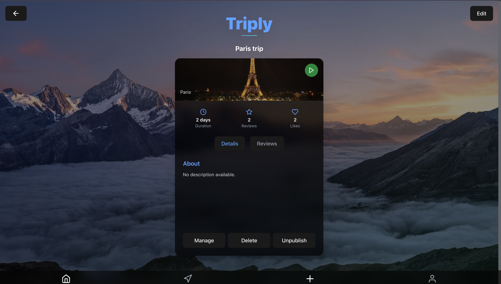
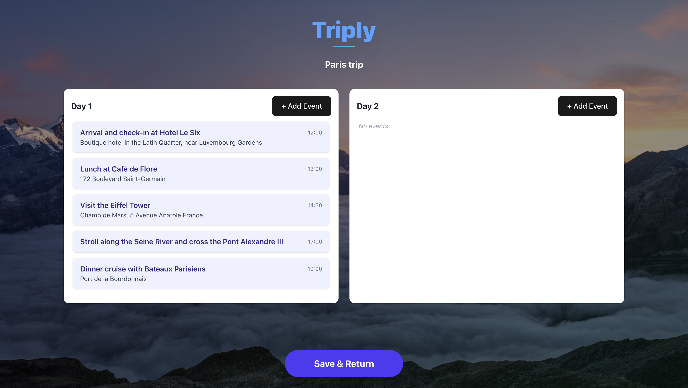

# Triply

## 📖 Overview

**Triply** is a modern, full-stack web application that transforms the way people plan and share their travel experiences. Built with cutting-edge technologies, our platform enables seamless collaborative trip planning with interactive maps, real-time collaboration, and a vibrant community of travelers.

## ✨ Key Features

### 🗺️ Trip Management

- **Create & Customize Trips** - Build detailed travel itineraries with multiple locations and rich descriptions
- **Visual Trip Cards** - Browse trips with stunning image previews and engagement metrics
- **Multi-day Planning** - Organize activities with intuitive drag-and-drop scheduling
- **Trip Sharing** - Share adventures via invite links and collaborate in real-time

### 👥 Social Features

- **Like System** - Save and discover favorite community trips
- **User Profiles** - Showcase your travel history and connect with fellow explorers
- **Collaborative Planning** - Invite friends to contribute to your trip planning
- **Community Discovery** - Explore and get inspired by trips from around the world

## 🖼️ Screenshots

### Login Page

### Home Page

### Profile Page

### Trip Details

### Edit Page

